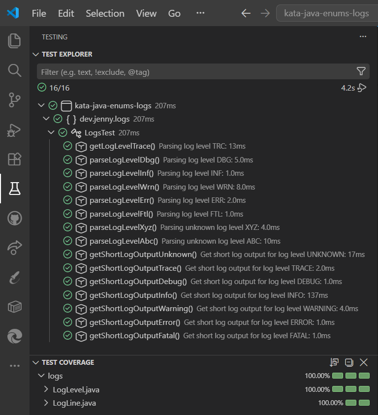

# 🔍 Kata Logs – Niveles y Parseo en Java

> Aquí los sentimientos no son ambiguos: o eres `INFO`, o ya estás `FATAL`

Ejercicio de **Exercism** en **Java 21 con Maven**, centrado en el uso de `enum` para modelar un conjunto fijo y cerrado de niveles de log, y en aplicar encapsulación básica para parsear y transformar líneas de log. Desarrollado sobre los tests dados (**JUnit 5 + Hamcrest**), con cobertura de tests medida con **JaCoCo**.

---

## 📑 Índice

- [Descripción](#-descripción)
- [Cómo reproducir el proyecto](#-cómo-reproducir-el-proyecto)
- [Estructura del repositorio](#-estructura-del-repositorio)
- [Testing](#-testing)
- [Tecnologías](#-tecnologías)
- [Autora](#-autora)

---

## 📋 Descripción

**Kata Logs** es un ejercicio que parte de una clase `LogLine`, que recibe el texto crudo de una línea de log (`"[LVL]: MESSAGE"`) y expone su nivel como un valor del `enum` `LogLevel`. También expone una versión abreviada de la línea, en la que el nivel se codifica como un número en vez de como texto.

### `LogLevel`

Enum con los 7 niveles:

- `TRACE`, `DEBUG`, `INFO`, `WARNING`, `ERROR`, `FATAL`, `UNKNOWN`

Cada valor lleva dos campos propios, definidos en el constructor:

- `code`: código de 3 letras (`"TRC"`, `"INF"`...). Vacío en `UNKNOWN`
- `encodedValue`: número usado en el formato corto

El propio enum sabe interpretarse a sí mismo:

- `fromCode(String code)` recorre `values()` buscando coincidencia
- Si no encuentra ninguna, devuelve `UNKNOWN`

### `LogLine`

No guarda el texto original de la línea de log, sino que lo parsea una sola vez en el constructor con dos métodos privados que calculan cada campo:

- `parseLogLevel()`: calcula y asigna `logLevel`
- `parseMessage()`: calcula y asigna `message`

A partir de ahí, expone:

- `getLogLevel()`: devuelve el `logLevel` ya calculado
- `getOutputForShortLog()`: construye el formato corto con `String.format`, usando `logLevel.getEncodedValue()` y `message`

Resolví la búsqueda del nivel con una iteración sobre los valores del enum, en vez de un `switch`. La puse dentro de `LogLevel`, no en `LogLine`, para que sea el propio nivel el que sepa reconocerse a partir de su código.

> **Nota:** el enunciado describe el formato corto como `"[<ENCODED_LEVEL>]:<MESSAGE>"` (con corchetes), pero su propio ejemplo (`"6:Stack Overflow"`) y los 15 tests dados por el ejercicio no los llevan. Lo implementé sin corchetes, siguiendo los tests como criterio real. Los corchetes sí forman parte del formato de entrada (`"[<LVL>]: <MESSAGE>"`, tal y como lo define el propio enunciado), no del de salida.

<details>
<summary><strong>Enunciado completo</strong></summary>

**Logs, Logs, Logs!**

Welcome to Logs, Logs, Logs! on Exercism's Java Track.

**Introduction**

**Enums**

An _enum type_ is a special data type that enables for a variable to be a set of predefined constants.
The variable must be equal to one of the values that have been predefined for it.
Common examples include compass directions (values of `NORTH`, `SOUTH`, `EAST`, and `WEST`) and the days of the week.

Because they are constants, the names of an enum type's fields are in uppercase letters.

**Defining an enum type**

In the Java programming language, you define an enum type by using the `enum` keyword.
For example, you would specify a days-of-the-week enum type as:

```java
public enum DayOfWeek {
    SUNDAY,
    MONDAY,
    TUESDAY,
    WEDNESDAY,
    THURSDAY,
    FRIDAY,
    SATURDAY
}
```

You should use enum types any time you need to represent a fixed set of constants.
That includes natural enum types such as the planets in our solar system and data sets where you know all possible values at compile time - for example, the choices on a menu, command line flags, and so on.

**Using an enum type**

Here is some code that shows you how to use the `DayOfWeek` enum defined above:

```java
public class Shop {
    public String getOpeningHours(DayOfWeek dayOfWeek) {
        switch (dayOfWeek) {
            case MONDAY:
            case TUESDAY:
            case WEDNESDAY:
            case THURSDAY:
            case FRIDAY:
                return "9am - 5pm";
            case SATURDAY:
                return "10am - 4pm"
            case SUNDAY:
                return "Closed.";
        }
    }
}
```

```java
var shop = new Shop();
shop.getOpeningHours(DayOfWeek.WEDNESDAY);
// => "9am - 5pm"
```

**Adding methods and fields**

Java programming language enum types are much more powerful than their counterparts in other languages.
The `enum` declaration defines a _class_ (called an _enum type_).
The enum class body can include methods and other fields:

```java
public enum Rating {
    GREAT(5),
    GOOD(4),
    OK(3),
    BAD(2),
    TERRIBLE(1);

    private final int numberOfStars;

    Rating(int numberOfStars) {
        this.numberOfStars = numberOfStars;
    }

    public int getNumberOfStars() {
        return this.numberOfStars;
    }
}
```

Calling the `getNumberOfStars` method on a member of the `Rating` enum type:

```java
Rating.GOOD.getNumberOfStars();
// => 4
```

**Instructions**

In this exercise you'll be processing log-lines.

Each log line is a string formatted as follows: `"[<LVL>]: <MESSAGE>"`.

These are the different log levels:

- `TRC` (trace)
- `DBG` (debug)
- `INF` (info)
- `WRN` (warning)
- `ERR` (error)
- `FTL` (fatal)

You have three tasks.

**1. Parse log level**

Define a `LogLevel` enum that has six elements corresponding to the above log levels.

- `TRACE`
- `DEBUG`
- `INFO`
- `WARNING`
- `ERROR`
- `FATAL`

Next, implement the `LogLine.getLogLevel()` method that returns the parsed log level of a log line:

```java
var logLine = new LogLine("[INF]: File deleted");
logLine.getLogLevel();
// => LogLevel.INFO
```

**2. Support unknown log level**

Unfortunately, occasionally some log lines have an unknown log level.
To gracefully handle these log lines, add an `UNKNOWN` element to the `LogLevel` enum which should be returned when parsing an unknown log level:

```java
var logLine = new LogLine("[XYZ]: Overly specific, out of context message");
logLine.getLogLevel();
// => LogLevel.UNKNOWN
```

**3. Convert log line to short format**

The log level of a log line is quite verbose.
To reduce the disk space needed to store the log lines, a short format is developed: `"[<ENCODED_LEVEL>]:<MESSAGE>"`.

The encoded log level is a simple mapping of a log level to a number:

- `UNKNOWN` - `0`
- `TRACE` - `1`
- `DEBUG` - `2`
- `INFO` - `4`
- `WARNING` - `5`
- `ERROR` - `6`
- `FATAL` - `42`

Implement the `LogLine.getOutputForShortLog()` method that can output the shortened log line format:

```java
var logLine = new LogLine("[ERR]: Stack Overflow");
logLine.getOutputForShortLog();
// => "6:Stack Overflow"
```

**Source**

**Created by**

- @sanderploegsma

</details>

[Volver al índice](#-índice)

---

## 🚀 Cómo reproducir el proyecto

### Requisitos previos

| Herramienta                                                   | Requisito                  | Guía de instalación                                                                                       |
| ------------------------------------------------------------- | -------------------------- | --------------------------------------------------------------------------------------------------------- |
| [JDK 21](https://www.oracle.com/java/technologies/downloads/) | Instalado y en el `PATH`   | [Ver guía](https://docs.oracle.com/en/java/javase/21/install/overview-jdk-installation.html)              |
| [Apache Maven](https://maven.apache.org/download.cgi)         | Instalado y en el `PATH`   | [Ver guía](https://maven.apache.org/install.html)                                                         |
| [Git](https://git-scm.com/downloads)                          | Para clonar el repositorio | [Ver guía](https://git-scm.com/book/es/v2/Inicio---Sobre-el-Control-de-Versiones-Instalaci%C3%B3n-de-Git) |

### Pasos

**1. Comprueba que tienes Java y Maven instalados** (si algún comando no se reconoce, instálalo desde los enlaces de _Requisitos previos_):

```bash
java --version
mvn --version
```

**2. Clona el repositorio:**

```bash
git clone https://github.com/Jennydev-25/kata-java-enums-logs.git
```

**3. Entra en la carpeta del proyecto:**

```bash
cd kata-java-enums-logs
```

**4. Ejecuta los tests** (compila y genera el reporte de cobertura de JaCoCo):

```bash
mvn test
```

El reporte de cobertura se genera en `target/site/jacoco/index.html`, que puedes abrir en el navegador

[Volver al índice](#-índice)

---

## 📁 Estructura del repositorio

```text
kata-java-enums-logs/
├── assets/
│   └── images/
│       └── test-explorer/
│           └── logs-test-explorer.png
├── src/
│   ├── main/java/dev/jenny/logs/
│   │   ├── LogLevel.java
│   │   └── LogLine.java
│   └── test/java/dev/jenny/logs/
│       └── LogsTest.java
├── .editorconfig
├── .gitignore
├── pom.xml
└── README.md
```

[Volver al índice](#-índice)

---

## 🧪 Testing

Los tests son los 15 dados por el ejercicio, sin modificar. Cubren los 3 escenarios del enunciado: parseo de los 6 niveles conocidos, fallback a `UNKNOWN` para niveles no reconocidos, y generación del formato corto para cada nivel.



| Test                       | Escenario                                          |
| -------------------------- | -------------------------------------------------- |
| `getLogLevelTrace`         | Parsea el nivel `TRC` como `LogLevel.TRACE`        |
| `parseLogLevelDbg`         | Parsea el nivel `DBG` como `LogLevel.DEBUG`        |
| `parseLogLevelInf`         | Parsea el nivel `INF` como `LogLevel.INFO`         |
| `parseLogLevelWrn`         | Parsea el nivel `WRN` como `LogLevel.WARNING`      |
| `parseLogLevelErr`         | Parsea el nivel `ERR` como `LogLevel.ERROR`        |
| `parseLogLevelFtl`         | Parsea el nivel `FTL` como `LogLevel.FATAL`        |
| `parseLogLevelXyz`         | Nivel desconocido `XYZ` cae en `LogLevel.UNKNOWN`  |
| `parseLogLevelAbc`         | Nivel desconocido `ABC` cae en `LogLevel.UNKNOWN`  |
| `getShortLogOutputUnknown` | Formato corto para nivel `UNKNOWN` → `"0:mensaje"` |
| `getShortLogOutputTrace`   | Formato corto para nivel `TRACE` → `"1:mensaje"`   |
| `getShortLogOutputDebug`   | Formato corto para nivel `DEBUG` → `"2:mensaje"`   |
| `getShortLogOutputInfo`    | Formato corto para nivel `INFO` → `"4:mensaje"`    |
| `getShortLogOutputWarning` | Formato corto para nivel `WARNING` → `"5:mensaje"` |
| `getShortLogOutputError`   | Formato corto para nivel `ERROR` → `"6:mensaje"`   |
| `getShortLogOutputFatal`   | Formato corto para nivel `FATAL` → `"42:mensaje"`  |

[Volver al índice](#-índice)

---

## 🛠️ Tecnologías

- **[Java 21](https://www.oracle.com/java/technologies/downloads/)** — Lenguaje de programación del proyecto
- **[Apache Maven](https://maven.apache.org/)** — Gestor de dependencias y construcción del proyecto
- **[JUnit 5](https://junit.org/junit5/)** — Framework de tests unitarios
- **[Hamcrest](https://hamcrest.org/JavaHamcrest/)** — Librería de matchers para aserciones legibles
- **[JaCoCo](https://www.jacoco.org/jacoco/)** — Medición de la cobertura de tests
- **[Visual Studio Code](https://code.visualstudio.com/)** — Editor usado para desarrollar y gestionar el proyecto
- **[Markdown](https://www.markdownguide.org/)** — Lenguaje de marcado para el README
- **[Git](https://git-scm.com/)** / **[GitHub](https://github.com/)** — Control de versiones y alojamiento del proyecto

---

## 👩‍💻 Autora

**[Jenny Sánchez Requejo](https://github.com/Jennydev-25)**

[Volver arriba](#-kata-logs--niveles-y-parseo-en-java)
